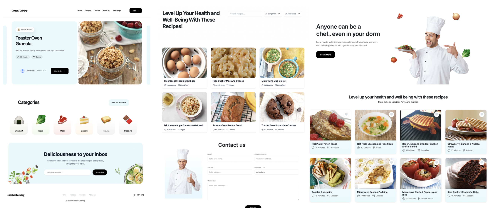

Campus Cooking is an application designed to help campus students prepare affordable, healthy, and accessible meals. By addressing common challenges such as limited kitchen resources, cooking skills, time, and access to grocery stores, Campus Cooking empowers students to make better food choices. With features like dietary filters, appliance filters, and simple step-by-step instructions, the application aims to improve student nutrition and lifestyle.

[Visit the deployed application](https://campus-cooking.vercel.app/) | [View the GitHub Organization](https://github.com/Campus-Cooking)

During the development of Campus Cooking, I took the lead on the design and front-end implementation. I created all the design mockups using Figma and built a majority of the components (aside from the "About Us" page), focusing heavily on the styling to ensure a modern, user-friendly interface. I also developed the initial GitHub Pages site and published most updates, which you can view [here](https://campus-cooking.github.io/college-cooking.github.io/). I also implemented the recipe search functionality with advanced filtering options. Additionally, I wrote Playwright tests to ensure the quality and reliability of the application. 
Collaborating on this project, with my back end engineers taught me valuable lessons about effective team communication, balancing workloads, and ensuring consistency across multiple components.

Working on Campus Cooking provided an excellent opportunity to refine my skills in UI design, software development and team collaboration. I gained more experience with design tools like Figma, strengthened my front-end development skills, and learned to write end-to-end tests using Playwright. The project also highlighted the importance of adhering to version control best practices, managing tasks through GitHub Issues, and maintaining clear documentation for both developers and end-users. Overall, this experience deepened my understanding of how to create accessible, user-centered applications in a collaborative environment.
